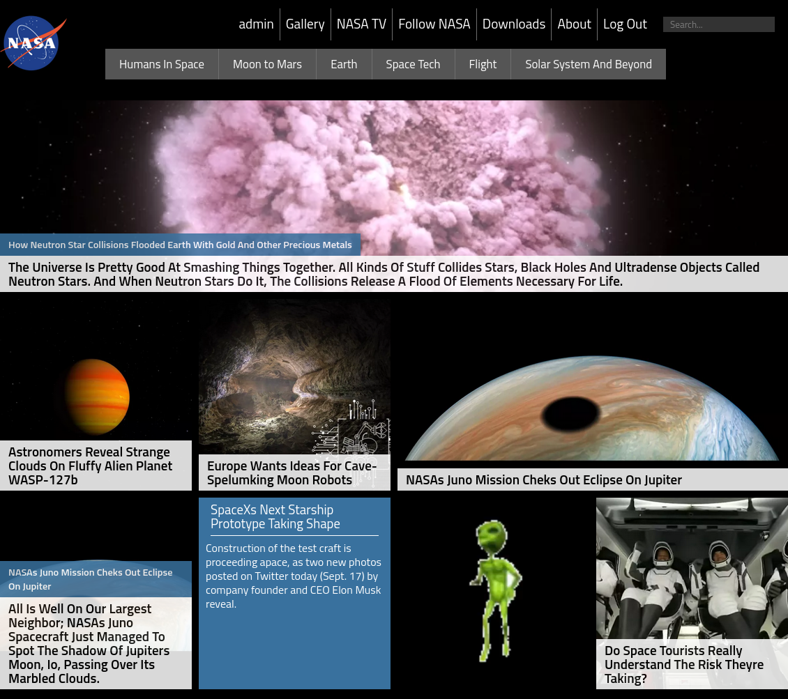
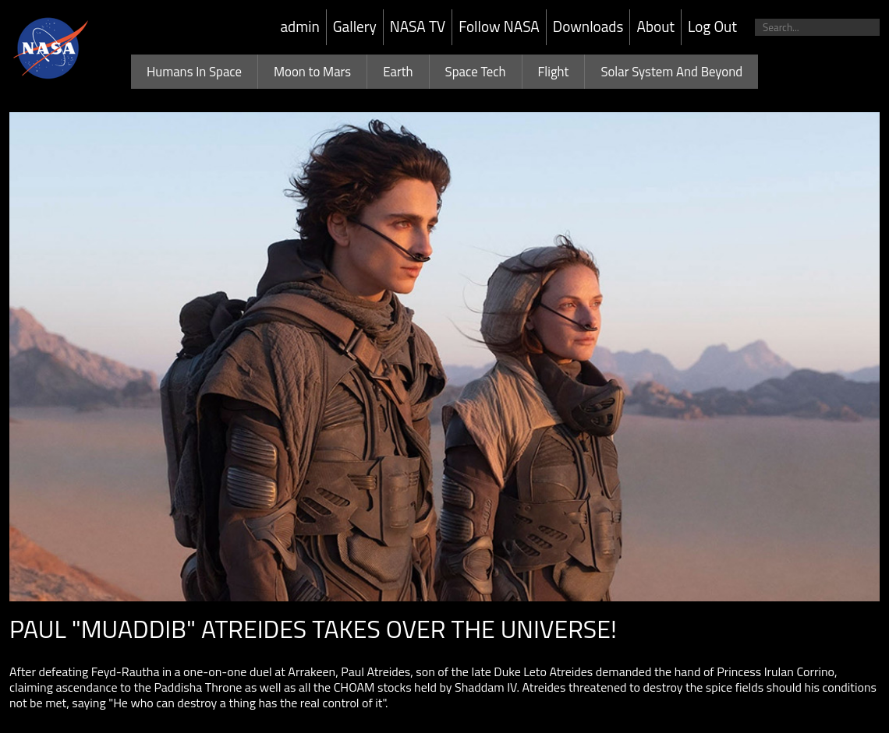

# NASA clone

This is a clone of NASA's homepage using HTML, CSS and PHP.

## Deploy

To deploy, clone the repository and copy it to your apache server's `www/html` directory, or clone the repository directly on that directory. In my case, using Fedora 40, it is located at `/var/www/html`.

Make sure Apache and MySQL services are running (my system uses systemd).

```bash
sudo systemctl start httpd
sudo systemctl start mysqld

cd /var/www/html
git clone https://github.com/DrJP99/nasa.git
cd nasa
```

If everything goes well, the website should be accessible at `localhost:80/nasa`.

For the page to load, you need the MySQL database to be running, you can create it running the script.

```bash
./db_setup
```

You must change your database's credentials in `db_setup` as well as in `db.php` for the website to load correctly.

## Adding News

An admin can add news to the database by logging in (the default credentials are **username**: `admin` & **password**: `abc123`) and clicking on the `admin` option on the navbar.

Here, you have a few options:

1. Delete a news article from the database
2. Add one or many news articles with a JSON file, and
3. Create a news article through a form

You can take a look inside `tests/` to see the structure of the JSON file to create news articles.

## Screenshots

Homepage



Search for an article


View an article in its own page


